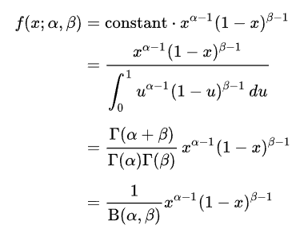
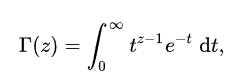
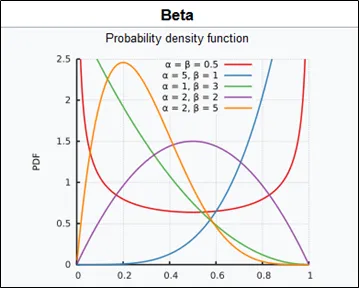
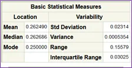
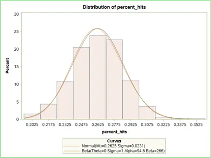

## What’s the Beta Distribution for?

Well out of the many probability distributions that exist, the beta distribution is another candidate distribution that models continuous data (or a continuous random variable — statistically speaking). Like the good old normal distribution if we have continuous data then this may be a better “fit” for our data depending on the data’s properties. Importantly, this distribution models a certain range of continuous data well (fractional data).

A main use of this distribution is that it models continuous data within a fixed interval of 0 to 1 like percentages and fractions.

## Beta Distribution Properties.

So, let’s get right to it; the formula below is the probability density function for the beta distribution.

The range of real number inputs for this function are between 0 and 1 (see what we mean by fractional data). The parameters of the distribution that are apparent from the formula are α and β, which of course we can specify and or estimate given our random variable, x. These two parameters can basically be adjusted both at a time or one at a time to change the shape of the distribution. The gamma function, Γ(z) is basically given by the following equation:

Here the, z in most applications is basically any positive number greater than 0. Which basically means that β, and α are usually positive numbers given the first equation.

Note. There are other variations of the beta probability density function, however the parameters for the most part remain the same and are not typically reparametrized. Just be sure to check the documentation of the software or package your using when you want to model with this distribution.

Interestingly the expected value and variance of the beta distribution only depends on the two parameters chosen. The expected value and variance are as follows.

E[Y]= α/(α+β)

Var[Y]=αβ/((α+β)² (α+β+1))

This implies what we stated before that the overall shape of the distribution is basically determined by the parameters.

What does the Beta Distribution Look Like?

Well why not show you a pretty graph from Wikipedia (“Beta Distribution”).

*Images of Beta Distributions from Wikipedia*

As you guys can see, the distribution is versatile and as the analyst you get a large variety of potential shapes to play with and model your data.

Now how about we try to fit this distribution to a real example of fractional data. Well use our baseball dataset and use a computed fraction of baseball hits per at-bats of a set of 322 players.

So lets look at the summary stats and show the comparisons between the beta distribution and the good old normal distribution.

*Summary statistics for our Baseball dataset*

Looks ‘normal’ by the summary stats numbers but let’s see how the beta and the normal distribution compare to fitting this data.

*The fit of the Beta Distribution and Normal Distribution*

We can see the parameter estimates that our software fit to this data distribution. In this case and as is the case with modern computing we can get optimal Alpha and Beta parameter estimates. Our optimal Mu and Sigma from the normal distribution is also given. (keep in mind that these are actually parameter estimates (or statistics) despite the Greek letters being used as we didn’t sample the whole population of baseball players).

Well in this case, our normal distribution fits quite well but in some cases with fractional data we may want to use the beta distribution for its flexibility. As we can see it approximated the normal distribution well.

Note. The theta and sigma are technically also kind of shape parameters that specify the bounds of the values that the beta distribution can take (it can be stretched past zero and one). The lower bound is just ‘Theta’ and the upper bound is ‘Theta + Sigma’. It is not super important now to specify them any differently than shown in the graphic (standard 0 to 1) but if you want to adjust the range of allowable values than you can tinker with them in your software

## The Scoop on the Beta Distribution

(I feel old for using the word ‘Scoop’). So, the bottom line of the beta distribution can be summed up in a few points and they serve as a great starting point when thinking about when and why a beta distribution should be considered for fitting and modeling data.

You could use the beta distribution

 

- When your data is a fractional (between 0 and 1).
- When it doesn’t necessary fit the normal distribution
- When you want a statistical model with more flexibility (specify your own parameters)
- When you want to compare it with other distributions that your data may ‘fit’ into

Well that’s all I have for you guys on the beta distribution. We also will have more content on how to actually fit a beta distribution in R and do statistical modeling with beta regression in future vids. If you like our content, please leave a thumbs up on the vid and subscribe for more content.

Thanks. Until next time guys. Happy mining!

*For more articles and content check out my <a href="https://www.youtube.com/channel/UCcPnyv1HXYEGxFsP6Z4P7yQ" target="_blank">YouTube Channel</a> if you like what I have to offer then please show your support and connect with me on <a href="https://www.facebook.com/ppatelfootball/" target="_blank">Facebook</a> and follow me on <a href="https://twitter.com/@dragoontik" target="_blank">Twitter</a>*