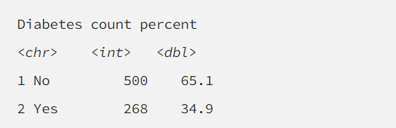
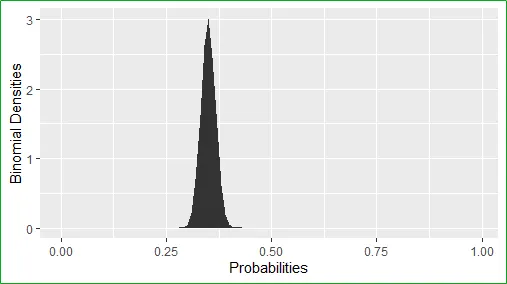

## Let’s Chat About the Good Old Binomial Distribution

So, when we have discrete binary data, many of you data-aware folks may have heard that you should model this data using the binomial distribution. Well in a way this is considered the standard statistical distribution for binary data (basically variables with only two possible values).

Why talk about this distribution? Well the focus of this article will be on how to fit binary data using this good old distribution. Fitting binary data with this distribution is easier with summary statistics of a binary variable as we will explain below.

## Properties of the Binomial Distribution

The binomial distribution as we sort-of alluded to is for modeling discrete binary data. The data for this distribution in the form of a random variable say, x is usually the number of “successes” (basically the event that we are interested in like the number of ‘favor’ in a political poll or a ‘Positive’ in a cancer screening test)

Note. “success” is not always a good thing in statistics unlike real life

The formula for the distribution is almost always written as:

f(X|n,p)=(n|x) p^x [(1-p)]^(n-x)

For those unfamiliar with the notation (Disclaimer: I have to look it up too):

(n|x)= n!/x!(n-x)!

The parameters of the binomial distribution are n, and p. The n is usually called the number of ‘trials.’ In most applied cases, it is usually the sample size or the number of observations in your dataset. We say, p is the probability of ‘success’; in other words, it is the probability that the event of interest occurs. Obviously in most applied cases we have no clue what that probability is, and we are most likely interested in estimating that probability.

Another common terminology you guys may come across is the Bernoulli trial or Bernoulli distribution. We have a separate article on the Bernoulli distribution but in brief, it is a related distribution to the binomial distribution. As for a Bernoulli trial, this is basically the sequence of events (observations) where we either have a ‘success’ or a ‘failure.’ This is essentially another name for a binary variable commonly seen in data applied analysis.

The mean and variance for the binomial distribution are calculated simply as:

E[X]=np

And

Var[X]=np(1-p)

These are important characteristics for approximating a normal distribution as we will see. Note that the mean and variance only depends on the true proportion of success p and the number of observations n.

## Importance of the Binomial Distributions

So, we know the binomial distribution is the go-to statistical distribution for fitting binary data but bear with me on a short but important list of why the distribution is essential to data science.

 

- It is the standard statistical distribution used to model binary data (For the third time)
- It can be approximated to the normal distribution (another article)
- It’s easy to use and implement in software
- More sophisticated analyses like Bayesian analysis and Machine Learning methods make extended use of this distribution.
- Its also approximates the Poisson distribution (interestingly)
- Its commonly and easily used in simulations and statistical bootstrapping

Okay so the list is a bit long, but it goes to show that the distribution is versatile.

## Let’s Take a Look at the Binomial Distribution

To get to the more exciting part, let’s model the pima Indian dataset using the proportion of participants with diabetes by fitting it to the binomial distribution.

So here is a look at the proportions. We see that our sample consists of about 35% diabetics and 65% none. The total number of observations is 500 + 268 = 768.

Let’s look at how the binomial distribution behaves using these specs. But will keep the estimated proportion of diabetics a ‘mystery’ from the binomial distribution computation.

*Binomial Distribution for finding Best Proportion*

As you can see, when we fit the n, parameters and the number of successes to the distribution it approximated a normal like distribution. We can see the max density is 3 and the proportion of success that has this maximal value is 0.35 or 35% (Not a coincidence).

We can see that the distribution converged on the actual value of successes, probably because the sample size was fairly large. (The large sample size also gives us the approximation).

In other topics we will walk through how this fitting can be done in R and go over how the distribution is used in statistical modeling and hypothesis testing.

Thanks. Until next time. Happy mining.

*For more articles and content check out my <a href="https://www.youtube.com/channel/UCcPnyv1HXYEGxFsP6Z4P7yQ" target="_blank">YouTube Channel</a> if you like what I have to offer then please show your support and connect with me on <a href="https://www.facebook.com/ppatelfootball/" target="_blank">Facebook</a> and follow me on <a href="https://twitter.com/@dragoontik" target="_blank">Twitter</a>*