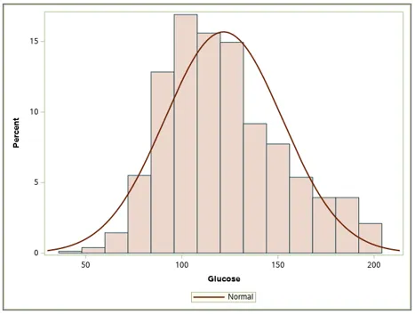
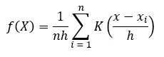
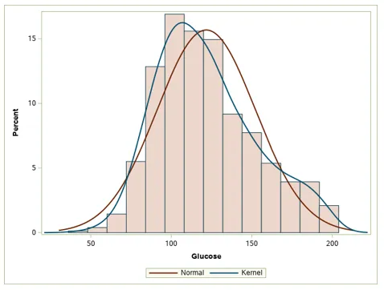

<iframe width="680" height="382" src="https://www.youtube.com/embed/eV6RivcfGxo" title="Density Curves" frameborder="0" allow="accelerometer; autoplay; clipboard-write; encrypted-media; gyroscope; picture-in-picture; web-share" allowfullscreen></iframe>

## One Step Up

As we all know the density curve is a step up from the useful histogram. A density curve gives all the same information that a histogram gives us but it can show us an approximate probability function of our numeric data as well.

To spell it out easier, a density curve helps us because it:

1. Shows the distribution of a numeric variable (Skewness)

2. Shows the approximate functional probability distribution of a numeric random variable(Functional form)

Basically, the density curve (or probability density curve) can be thought of as a probability density function of our sample data.

## Types of Density Curves

Technically there are theoretically many types of probability density curves which we can try fit to our sampled numeric variable using a whole bunch of probability density functions. But to keep it simple we only introduce two main types of density curves.

1. Normal density curve
2. Kernel density curve

The Normal density curve is just that, a fitted density curve using the good old normal distribution.

Check out the example below of blood glucose from the Pima Indian dataset.

Note that I overlaid the density curve on-top of the histogram; this is a super common practice and probably a good one as it lets us see how well the probability distribution fits the actual data.

The kernel density curve is best understood as an estimated outline of the sample distribution. In more technical language we can think of kernel density estimation as a mathematical “smoothing” operation which helps grasp the shape of the distribution outlined by the histogram more accurately.

The formula for how this kernel density curve is computed is given by

So, what’s up with this? First off n is the number of observations in our dataset, i represents the ith observation, Xi is the variable in the summation, h is a special smoothing parameter called the ‘bandwidth’, and of course K is called the kernel which is basically a non-negative mathematical function that we can choose if we like.

Note. Here xi is the actual data summed up by the summation and x is the actual value on an x-axis of a graph that f(X) is computed at

Here is a basic look below at the kernel density curve along with the normal density curve for comparison.

Notice that the kernel curve is shaped a bit more like the actual distribution. This is what we mean by ‘smoothing’.

## Bottom Line

To wrap it all up, the density curve is an excellent tool for visualizing a numeric variable’s distribution. It also gives insight into the theoretical probability distribution of the data.

Hope that was a quick and helpful. If this was helpful or you want to see more content on statistics and data science, then check us out on YouTube. We also have a articles planned on types of kernel function for kernel density curves. Until then happy mining.

*For more articles and content check out my <a href="https://www.youtube.com/channel/UCcPnyv1HXYEGxFsP6Z4P7yQ" target="_blank">YouTube Channel</a> if you like what I have to offer then please show your support and connect with me on <a href="https://www.facebook.com/ppatelfootball/" target="_blank">Facebook</a> and follow me on <a href="https://twitter.com/@dragoontik" target="_blank">Twitter</a>*