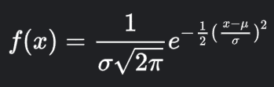
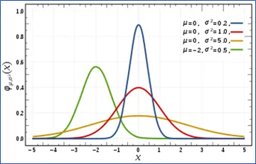
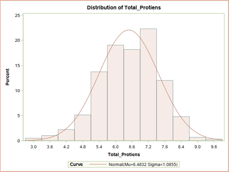

## The Most Commonly Used Distribution

In this article we will be talking about the good old normal distribution. This is probably the most well-known, widely applied and often most mis-applied distribution that exists. If you have ever taken a statistics course, an introductory psychology course (first time I heard of this distribution) or any other course that discusses statistics then you know something about this distribution. So, we will cover this one quickly but focus on its use in applied statistics and of course data science and model building.

## Properties of the Normal Distribution

So lets talk quickly about the “mathy” part of the normal distribution. The formula is:

The exp(.) part of the equation means to the power of e=2.718. As some of you guys might have learned the mean, μ and standard deviation, σ are the parameters of the normal distribution as we can also see from the function notation. The graph of course looks like lines below when varying specified parameters are specified:

*Normal Distribution from Wikipedia*

While the scale of our random variable x, (or y, whichever variable name we choose) of our random variable can be any real number (-inf, +inf), we often can transform the values of our random variable into standard z-scores using the following formula:

z=(y-μ)/σ

First off, this formula is primarily used to make computing the probability distribution function easier so that the probabilities under the curve can be calculated (it’s also used to “standardize” data but that is another topic for another article).

Now a-days we use software rather than those awful tables found in textbooks to compute normal distribution probabilities under the curve. Second, these probabilities are good only when you know the true population means and standard deviation which in most cases, we just use our sample estimates because we really don’t have anything better.

## Usage of the Normal Distribution

Now to the real important part, “What is the normal distribution used for”. The common uses are

- Hypothesis testing (Comparing means and proportions)

- Parameter inference (Confidence intervals)

- Linear regression modeling (of the response variable, output feature, dependent variable etc)

- Modeling and fitting real number variables that can take valued between (-inf, +inf)

- It helps approximate the binomial distribution

- Approximate the Poisson distribution

So, as you can see the normal distribution is most of the backbone of applied statistics, but not all of it.

What the normal distribution can’t do:

- Model count data in a regression well

- Model binary data in a regression well

- Model data that is between fixed intervals (say 0 to 1 well)

- Fit non-normal or naturally skewed data

- Analysis of text data or more direct forms of qualitative data

While the normal distribution is great in a lot of situations it can fall short in others. It is recommended that you explore all the potential options, methods, distributions, and algorithms for data analysis that are available to you and pick the ones to use based on your: data, needs or purpose, communication to your audience, and (hate to sound cliché) what ‘story’ your ultimately trying to tell with your analysis or modeling.

## Examples of Fitting a Normal Distribution

Now my favorite part. Let’s look at some examples.

Let’s fit some data on the total number of proteins from the liver dataset

*Liver Dataset Example of Normal Distribution*

We can see that when we fit the distribution to the data, we get an estimated mean (mu) and standard deviation (sigma) and of course these are estimates of the parameters as we don’t have all the data from the population. The normal distribution looks like it fits fairly well. Note these estimates for mu and sigma are the same if you calculated the mean and standard deviation using typical formulas (or more reasonably another software function). That means that the formulas for the mean and standard deviation of a sample are the “best unbiased`” estimates of the normal distribution parameters mu and sigma.

(side-note. This can be proven mathematically, but we focus instead on the concept of best estimators for mean and sigma. Thus, it’s no coincidence that we use these formulas for mean and sigma, we use them because they were proved mathematically to have low estimation bias as parameter estimates).

In fact, the expected value (mean) and the variance of the normal distribution are:

E(Y)= μ=(∑yi)/n

Var(Y)= σ²=(∑y^n[(yi-y)]² )/n

Which are your typical mean and variance formulas found in textbooks.

Hope that enlightens you guys on the normal distribution if it is new to you. Until next time guys. Happy mining!

*For more articles and content check out my <a href="https://www.youtube.com/channel/UCcPnyv1HXYEGxFsP6Z4P7yQ" target="_blank">YouTube Channel</a> if you like what I have to offer then please show your support and connect with me on <a href="https://www.facebook.com/ppatelfootball/" target="_blank">Facebook</a> and follow me on <a href="https://twitter.com/@dragoontik" target="_blank">Twitter</a>*

